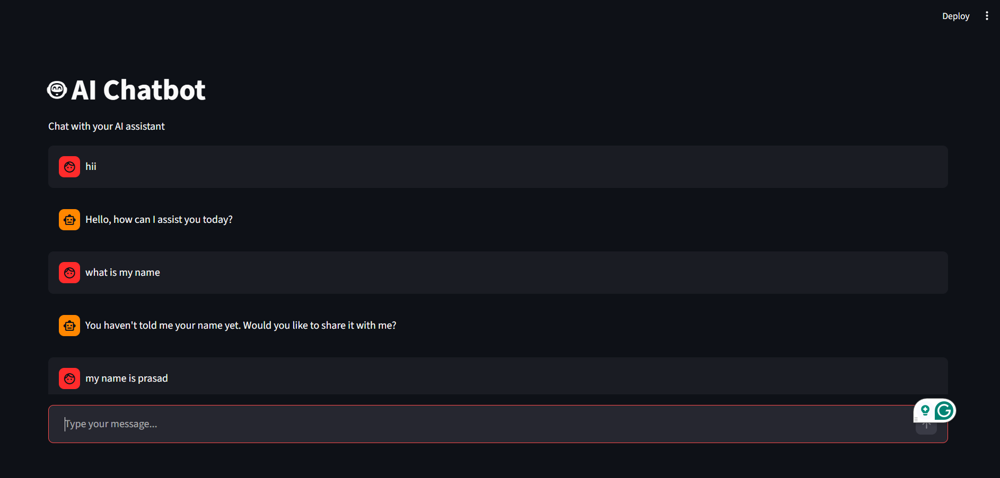

# 🤖 AI Chatbot using Python & Streamlit

This project is a simple **AI Chatbot** built using **Python and Streamlit**.
It allows users to interact with an AI model through a clean web interface and receive real-time responses.

The chatbot uses the **Groq API with the Llama 3.1 model** to generate intelligent replies.

---

## 🚀 Features

* Interactive chat interface
* Real-time AI responses
* Chat history management
* Secure API key handling using environment variables
* Clean and simple Streamlit UI

---

## 🛠 Technologies Used

* Python
* Streamlit
* Groq API
* Llama 3.1 Model
* python-dotenv

---

## 📂 Project Structure

ChatBot-Using-Python
│
├── app.py
├── main.py
├── requirements.txt
├── .env.example
└── README.md

---

## ⚙️ Installation

### 1️⃣ Clone the repository

git clone https://github.com/prasad200904/ChatBot-Using-Python.git

### 2️⃣ Navigate to the project folder

cd ChatBot-Using-Python

### 3️⃣ Create virtual environment

python -m venv env

Activate environment

Windows:

env\Scripts\activate

Mac/Linux:

source env/bin/activate

### 4️⃣ Install dependencies

pip install -r requirements.txt

---

## 🔑 Environment Setup

Create a `.env` file and add your Groq API key.

GROQ_API_KEY=your_api_key_here

⚠️ Do not upload `.env` to GitHub.

---

## ▶️ Run the Application

streamlit run app.py

or

python -m streamlit run app.py

Then open your browser at:

http://localhost:8501

---

## 📸 Screenshot

---

## 📌 Future Improvements

* Chat history sidebar
* Save conversations to database
* User authentication
* Deploy chatbot online

---

## 👨‍💻 Author

**Prasad**

AI Enthusiast passionate about building intelligent applications using Python and AI technologies.
